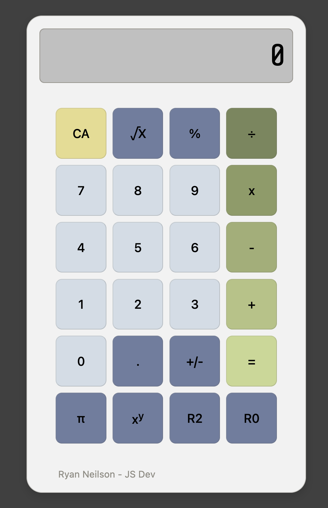

# JavaScript Calculator

A fully functional calculator built with **HTML**, **CSS**, and **JavaScript**. Features include basic arithmetic operations, advanced functions, and a responsive design that works across desktop and mobile devices.

## Demo



You can view the live demo [here](https://ryanandtay.github.io/calculator/).

## Features

- **Basic arithmetic:** addition, subtraction, multiplication, division
- **Advanced functions:** square root, exponentiation, percentage, rounding (0 or 2 decimals)
- **Sign toggle:** switch between positive and negative
- **Pi constant support**
- **Responsive design** for mobile and desktop
- **iOS-friendly:** prevents zooming on repeated button taps

## Technologies Used

- **HTML5** for structure
- **CSS3** for styling and layout
- **JavaScript (ES6)** for interactivity
- Google Fonts: [Share Tech Mono](https://fonts.google.com/specimen/Share+Tech+Mono)

## Installation

1. Clone the repository:

```bash
git clone https://github.com/yourusername/your-repo-name.git